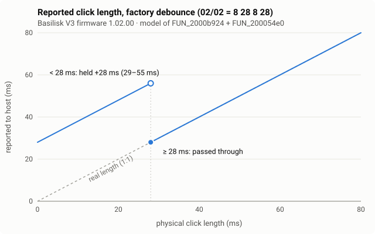

# Click debounce and the "microclick" padding

This note explains why short clicks on a Basilisk V3 are held longer than you pressed them. It is based on firmware
v1.02.00 (`firmware/decompiled/BasiliskV3_FW_v1.02.00.c`), and every step below was checked against the disassembly.
`tools/python/debounce_sim.py` is a cycle-level port of the two functions involved, and it produced all the numbers on
this page.

## Summary

With factory settings, every button uses a **28 ms lockout after every reported edge**. The press itself is sent
immediately.

* **A click shorter than 28 ms** is held for **its own length plus 28 ms**, so the host sees 29–55 ms.
* **A click of 28 ms or more** is reported at its real length, ±1 ms of USB frame quantisation.
* **After a short click** there is another lockout of about 28 ms, during which the next click is **dropped** if it
  is shorter than 28 ms, or **delayed by 28 ms** if it is longer. A second click that starts before the padded release
  is merged into the first one.



The lockout length comes from settings that the host can change. Command `02/02` writes them, `02/82` reads them,
and they are stored in on-chip flash. Synapse can therefore move the 28 ms threshold anywhere from 0 to 30 ms, and the
mouse you are testing may not be on factory values. See [Settings](#settings-0202--0282).

## Where it lives

| Address | Name used here | What it does |
|---|---|---|
| `0x2000B924` `FUN_2000b924` | `button_scan_debounce` | Samples 11 button GPIOs (active low), runs the per-button state machine, and calls `button_action_execute(1/0, idx)` on press/release |
| `0x200054E0` `FUN_200054e0` | `button_debounce_tick` | Updates the per-button counters. Called once per USB frame |
| `0x20001EF0` `FUN_20001ef0` | `usb_sof_handler` | Called from the USB0 ISR on `INTSTAT` bit 30 (`FRAME_INT`, every 1 ms). Restarts CTIMER1, calls the tick, sets `0x04000D65 = 2` |
| `0x20000930` (no Ghidra function) | `ctimer1_phase_cb` | CTIMER1 match callback. Splits each frame into 20 phases of 50 µs. Phase 13 sets bit 2 of `0x04000D65` (scan enabled) and phase 16 clears it |
| `0x2000AD88` `periodic_tasks` | | Main-loop task runner. Calls `FUN_2000b924` while bit 2 of `0x04000D65` is set |
| `0x04000A18 + 6·i` | per-button state | `flags` (bit0 = edge seen, bit1 = lockout), `rep` (reported state), `cnt`, `dis`, –, `lifted` |
| `0x04000D68..0x04000D6B` | `d68 d69 d6a d6b` | press delay, press lockout, release delay, release lockout (factory `8 28 8 28`) |
| `0x04000547` | `sensor_lifted` | bit 3 of byte 0 of the sensor's register 0x16 burst. This is `Lift_Stat` on PixArt PMW33xx-family sensors |

Buttons 0–10 are wired to P0.29, P0.30, P0.8, P0.0, P0.21, P0.18, P0.19, P0.22, P0.1, P1.3 and P1.8. Buttons 0 and 1
are the two read at power-on by `FUN_20000c3c`, so they are almost certainly left and right.

## Timing inside one 1 ms frame

`FUN_2000e154` measures 200 USB frames with CTIMER1, then sets the match register to `frame_ticks / 20 - 1`. Each SOF
then restarts the timer and the phase counter (`0x04000394`):

```
t =   0 us   SOF IRQ   -> button_debounce_tick()         (uses the bitmap saved by the last scan)
t = 700 us   phase 13  -> 0x04000D65 |= 4   main loop now calls button_scan_debounce() repeatedly
t = 850 us   phase 16  -> 0x04000D65 &= ~4
t = 900 us   phase 17  -> 0x04000D65 |= 0x10  HID input report built (FUN_2000bbb0 / FUN_2000aed4)
```

So **every counter unit is exactly one USB frame (1 ms)**. Buttons are sampled during a 150 µs window in each frame,
so a press shorter than about 0.9 ms can fall between windows and never be seen.

## The state machine

Here `raw` is the GPIO level (1 = released), and `rep` is what the host was last told (1 = pressed). Because the pins
are active low, **`rep == raw` means the switch disagrees with the reported state**.

```c
/* button_debounce_tick(), once per 1 ms frame */
if ((flags & LOCKOUT) && cnt) {
    if (rep == raw) dis++;          /* disagreeing: count how long */
    else            cnt--;          /* agreeing: the lockout runs down */
} else if (raw == 0) {              /* held */
    if (rep != 1 && (flags & EDGE)) cnt++;
} else {                            /* up */
    if (rep != 0 && !(flags & EDGE)) cnt++;
}

/* button_scan_debounce(), several times per frame in the 700..850 us window */
if (flags & LOCKOUT) {
    if (cnt) {
        if (rep == raw) { if (dis >= d69) flags &= ~LOCKOUT; }   /* note: d69 for BOTH edges */
        else            dis = 0;
        continue;
    }
    flags &= ~LOCKOUT;
}
if (raw == 0) {                                   /* held */
    if (rep == 1) { cnt = 0; continue; }
    if (!(flags & EDGE)) {
        flags |= EDGE; cnt = 1;
        if (!lifted && (i == 0 || i == 1)) goto press;  /* primary buttons: report at once */
        continue;
    }
    if (cnt > (lifted ? d68 : 0)) {
press:  button_action_execute(1, i);
        rep = 1; flags |= LOCKOUT; cnt = press_lock; lifted = 0;
    }
} else {                                          /* up */
    if (rep == 0) { cnt = 0; continue; }
    if (flags & EDGE) { flags = 0; cnt = 1; continue; }
    if (cnt > (lifted ? d6a : 0)) {
        button_action_execute(0, i);
        rep = 0; flags |= LOCKOUT; cnt = release_lock; lifted = 0;
    }
}
```

On the surface, `press_lock = d69` and `release_lock = d6b`. While the sensor reports lift-off, they become
`d69 - d68` and `d6b - d6a`, and both edges must be stable for more than `d68` / `d6a` ms before they are reported.
With factory values, a click of 8 ms or less made while the mouse is lifted is ignored completely.
Any lock value above 30 is clamped to 28.

A lockout ends either when `cnt` reaches 0 or when the switch has disagreed with `rep` for `d69` consecutive ms
(`dis`). Because `cnt` only counts down while the switch **agrees** with the reported state, releasing early freezes
it. The only way out is then 28 ms of continuous release.

### Worked examples (factory settings, results from `debounce_sim.py`)

| Physical | Host sees | Why |
|---|---|---|
| 10 ms click | press at once, release at +38 ms | 10 ms counts `cnt` 28 → 18. After release, `dis` needs 28 ms |
| 27 ms click | 55 ms | `cnt` is still 1 at release, so the 28 ms `dis` path applies |
| 28 ms click | 28 ms | `cnt` hits 0 while held, the lockout ends, and the release is sent at once |
| 60 ms click | 60 ms | as above |
| 10 ms click, then 10 ms click starting at +11…+38 ms | **one** press of 49–76 ms | the second press agrees with `rep = 1`, resets `dis`, and keeps the first press alive |
| 10 ms click, then 10 ms click starting at +39…+65 ms | **second click lost** | it falls in the release lockout and is shorter than 28 ms |
| 10 ms click, then 40 ms click starting at +39…+65 ms | second press **28 ms late** | as above, but long enough for `dis` to reach 28 |
| 10 ms click, then any click from +66 ms | both normal | release lockout already over |

Reproduce with, for example, `python3 tools/python/debounce_sim.py --clicks 0:10 50:10`.

## Settings (`02/02` / `02/82`)

`razer_cmd_class02_keymap` (0x20008814):

* `02/02`, 4 argument bytes `[d68, d69, d6a, d6b]`: store and call `settings_mark_dirty(2, 0)`, which persists them.
  With `data_size = 2`, `[delay, lock]` is applied to both edges.
* `02/82`: returns the four bytes in `args[0..3]`.

They belong to settings group 2, an 11-byte block at `0x04000D66` (`0b 00 | d68 d69 d6a d6b | d6c d6d d6e | crc16`).
`FUN_2000e414` loads it at boot from on-chip flash `0x28100`. If the length or CRC-16/CCITT (`FUN_20005954`) does not
match, it falls back to the factory copy at `0x2000EA9A` (`0b 00 08 1c 08 1c 50 00 00 00 00`), which is the same copy
`00/0B [1]` (factory reset) restores.

Request bytes in the 91-byte report format from [protocol.md](protocol.md). The firmware does not check the
transaction ID.

```
get:  00 | 00 1f 00 00 00 04 02 82 | 00 x80 | 84 00                 crc = 04^02^82
set:  00 | 00 1f 00 00 00 04 02 02 | a b c d 00 x76 | crc 00        crc = 04^a^b^c^d
```

In the model, setting the lock bytes to 0 (`02/02 08 00 08 00`) removes the padding completely, and a lock of N ms
pads clicks shorter than N by N. The lockout is the firmware's switch-bounce protection, so a small non-zero value
is the safer choice if you experiment.

## Caveats

* This is a model of v1.02.00, not a hardware measurement. Later firmware may differ. Read `02/82` from your own mouse
  first, because Synapse may have changed the values.
* The host only sees whole 1 ms frames. The "±1 ms" above is the frame alignment of the release.
* Only the timing is modelled. What a button actually sends (left click, macro, …) is decided in `button_action_execute`.
* Side note: the interrupt and peripheral layout (WWDT `0x4000C000`, GINT0/1, PINT, UTICK, CTIMER0/1/3, SCT0, USB0 as
  IRQ 28, Flexcomm 0–7 at `0x40086000…0x40098000`, GPIO at `0x4008C000`, SRAMX at `0x04000000`, SRAM0 at `0x20000000`)
  matches NXP's LPC51U68 / LPC5411x family. The peripheral names above come from that match.
